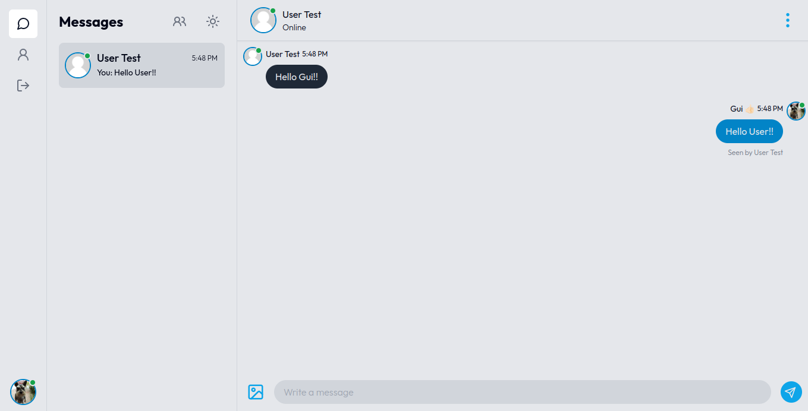
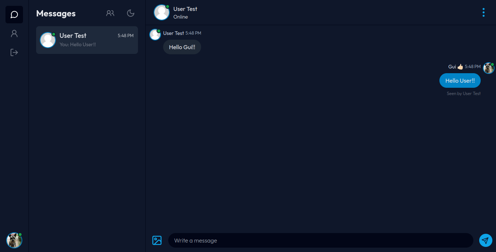
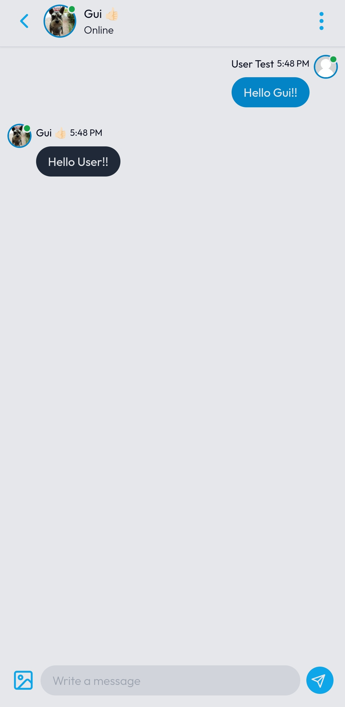
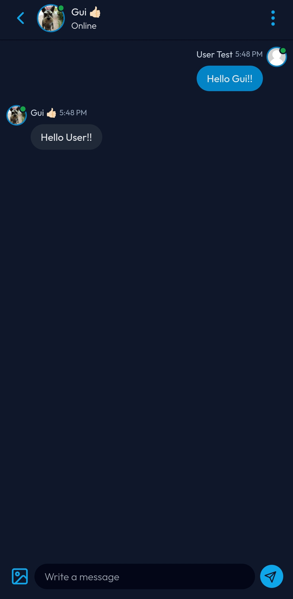
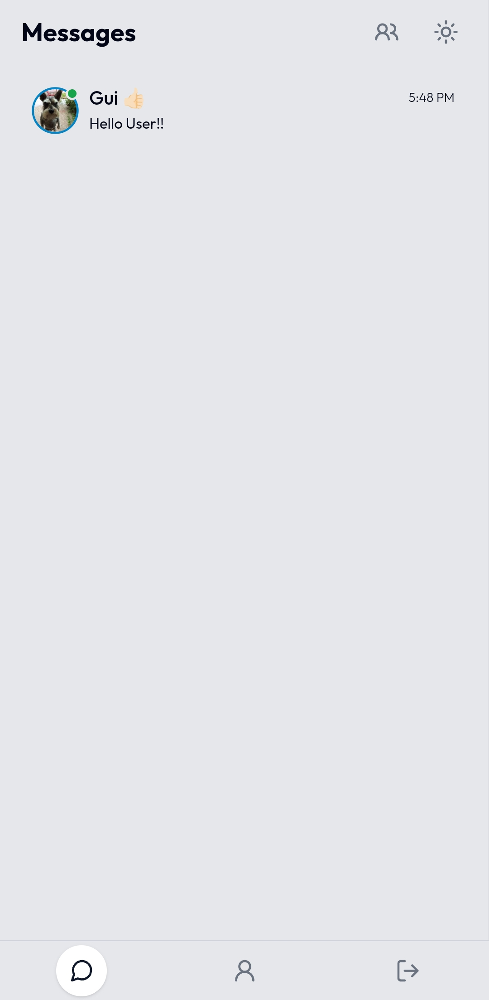
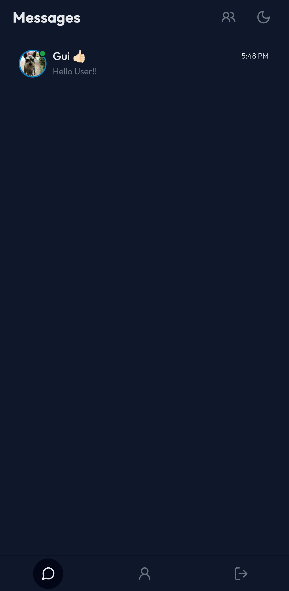

# GChat

This is a fullstack project for a chat application in real time developed in NextJS 13.4, with an interface inspired by Meta's Mensseger.

## Functionalities

The chat application has the following features:

- Login with email and password;
- Login with google;
- Login with github
- Validation of empty fields and correct email formatting;
- Choice of theme for interface customization;
- Start new conversations;
- Real-time messages;
- Delete conversations;
- Update your profile;
- Start groups;
- Report on who viewd messages;
- Check if user is online;
- Send images;

When using the application, the user can log in or register as a new user, after this process, he will be redirected to the users page, where he can choose someone to start a new conversation. The application has support for sending images, Cloudnary was used to host the images. In addition, the user can choose a theme to customize the appearance of the application.

## Technologies used

- Next 13.4
- TypeScript
- React
- Axios
- Zod
- Lucide Icons
- Cloudnary
- Pusher
- MongoDB Cloud
- Prisma
- TailwindCSS
- <a href="https://storyset.com/user">Illustrations by Storyset</a>

## How to use

To use the application, just access the link https://gchat-nine.vercel.app/

## How to install locally

1. Download the project to your computer or clone the repository using the following command:

```Shell
git clone https://github.com/Guilherme-Silva0/GChat.git
```

2. Open the terminal in the project directory and run the following command to install the dependencies:

```Shell
npm install
```

3. Then run the following command to launch the application:

```Shell
npm run dev
```

4. The application will open in your browser at the address [http://localhost:3000](http://localhost:3000).

## Screeshots

- Messages page Desktop:
  

- Messages page Desktop Dark Mode:
  

- Message page Mobile:
  

- Message page Mobile Dark Mode:
  

- Conversations page Mobile:
  

- Conversations page Mobile Dark Mode:
  

## License

This project is licensed under the MIT. For more information, see the LICENSE file.

## Final considerations

Hope you enjoyed this project! If you have any questions or suggestions, please feel free to get in touch.
